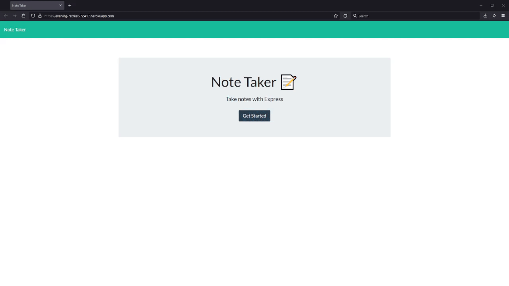

# Note Taker

## Description

This application can be used to write, save, and delete notes. It uses an Express.js backend and the note database is provided via a JSON file.

This application is deployed on Heroku. You may find it here: [https://evening-retreat-72417.herokuapp.com/](https://evening-retreat-72417.herokuapp.com/)

### The Story

This Note Taker web app was created to mee the requirements of the following user story:
```
AS A small business owner
I WANT to be able to write and save notes
SO THAT I can organize my thoughts and keep track of tasks I need to complete
```

### Screenshot of the Note Taker



### For Further Details:

Please check the repository's commit history and associated comments to see more information about this Note Taker web application.